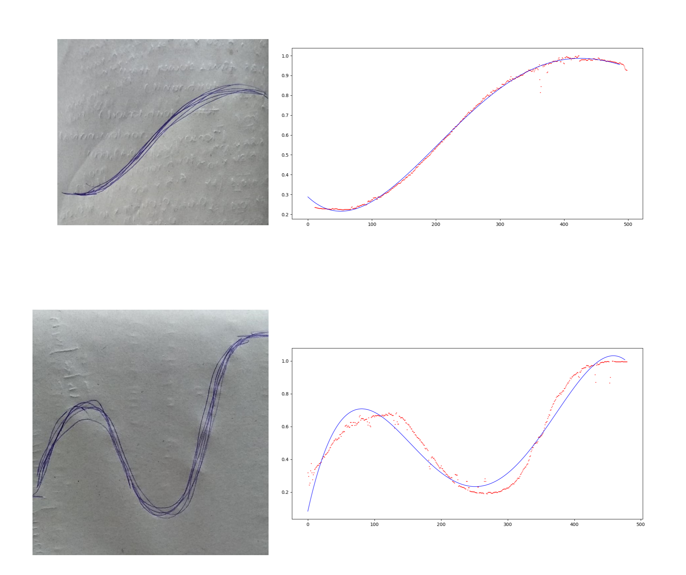

# Fun-projects
Contains projects I tried for fun.
___

## 1.Pixel to ASCII 
- Converts a picture to ascii characters depending on their brightness values from 0 to 255.
- Code: [convert_picture_to_ascii.py](./convert_picture_to_ascii.py)

## 2.Picture to curve equation  
- Have you ever wondered that life would be simpler if you could just get the equation of a particular graph that you see online or the curve you've just free-handed. Because you can just use the equation to represent a series of datapoints in your work mathematically therefore on any digital domain. 
- This project just does that.
- All you need is a picture of a curve you are interested to know the equation of.
- Code: [picture_to_equation.py](./picture_to_equation.py)

