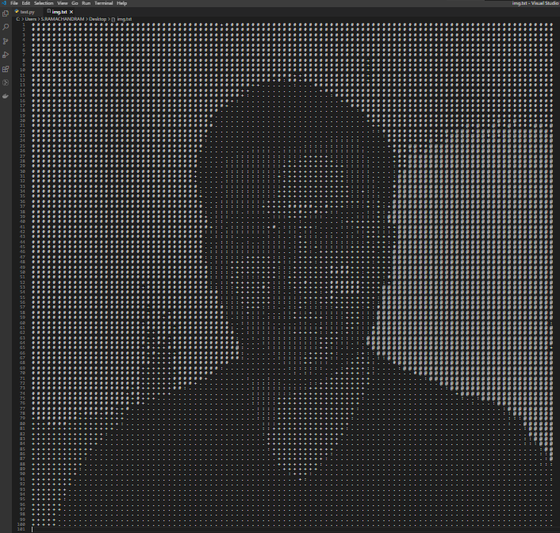

# Fun-projects
Contains projects I tried for fun.
___

## 1.Pixel to ASCII 
- Converts a picture to ascii characters depending on their brightness values from 0 to 255.
- Code: [convert_picture_to_ascii.py](./convert_picture_to_ascii.py)

## 2.Picture to curve equation  
- Have you ever wondered that life would be simpler if you could just get the equation of a particular graph that you see online or the curve you've just free-handed. Because you can just use the equation to represent a series of datapoints in your work mathematically therefore on any digital domain. 
- This project just does that.
- All you need is a picture of a curve you are interested to know the equation of.
- Code: [picture_to_equation.py](./picture_to_equation.py)

## 3.Resize images to adjust memory contraints  
- Mostly usable when you want to upload your profile pic or some other pic but the website keeps a memory constraint for the upload.
- Code: [resize_image.py](./resize_image.py)

## 4. Double the FPS of any video  
- Averages two adjacent frames and creates and intraframe to double the FPS of a video.
- Cannot enocode Audio.
- Code: [double fps](double_fps.py)

## 5. Scrape a website to get all the IP address ranges of all countries.
- Scraped from [Website](https://lite.ip2location.com/ip-address-ranges-by-country)
- Code: [scrape for ips](./scrape_for_ips.py)
